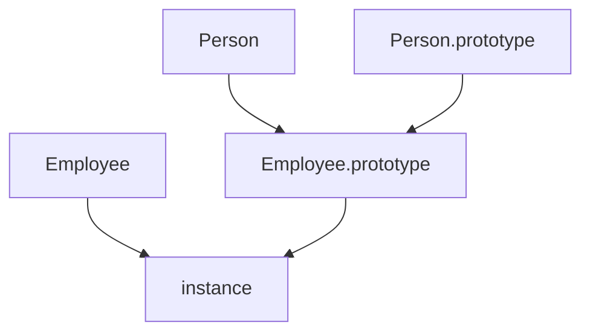

# 선행

- [프로토타입 (Prototype)](https://devshjeon.github.io/docs/%ED%94%84%EB%A1%9C%EA%B7%B8%EB%9E%98%EB%B0%8D/JavaScript/9.%ED%94%84%EB%A1%9C%ED%86%A0%ED%83%80%EC%9E%85%20(Prototype))

# 요약

- 어떤 공통된 속성이나 기능을 정의한 추상적인 개념
- 클래스 자체에서만 접근 가능한 static 멤버와 인스턴스에서 직접 사용할 수 있는 프로토타입 객체가 있다.
- 클래스 간 상속관계를 정의할 수 있다.
- ES5까지는 생성자 함수를 이용해서 상속관계를 정의했지만, ES6부터 `class` 키워드가 등장하면서 사용이 간편해졌다.

# 클래스 (Class)란?


클래스는 어떤 공통된 속성이나 기능을 정의한 추상적인 개념이고, 이 클래스에 속한 객체를 인스턴스라 한다.


클래스 자체에서만 접근 가능한 static 멤버와 인스턴스에서 직접 사용할 수 있는 프로토타입 객체가 있다.


클래스 간 상속관계를 정의할 수 있다.


# 클래스 상속


클래스 간 상속이 가능한 계층구조를 정의할 수 있다.


다음 2개의 클래스를 예시로 살펴보자.


```javascript
function Person(name, age) {
  this.name = name || '이름없음';
  this.age = age || '나이모름';
}

Person.prototype.getName = function() {
  return this.name;
}

Person.prototype.getAge = function() {
  return this.age;
}

function Employee(name, age, position) {
  this.name = name || '이름없음';
  this.age = age || '나이모름';
  this.position = position || '직책모름';
}

Employee.prototype.getName = function() {
  return this.name;
}

Employee.prototype.getAge = function() {
  return this.age;
}

Employee.prototype.getPosition = function() {
  return this.position;
}
```


`Person`과 `Employee`는 `Person`이라는 공통된 특성을 갖고 있기 때문에 상속구조가 가능하다.





이러한 상속구조를 코드로 만들기 위해서는 다음과 같다.


```javascript
Employee.prototype = new Person();
Employee.prototype.constructor = Employee;
Employee.prototype.getPosition = function() {
  return this.position;
}
```


위 패턴에는 문제점이 존재하는데, `Employee`의 프로토타입 객체를 `Person` 인스턴스로 지정하면서 `Person`의 속성이 존재한다는 것이다.


`Employee`의 속성 중 공통된 속성이 삭제되면 프로토타입 체인닝에 의해  `Person` 인스턴스의 속성에서 찾는데, 값이 다르다면 문제가 될 수 있다.


따라서, `Employee`와 `Person` 중간에 빈 객체를 도입하여 이런 문제를 해결할 수 있다.


```javascript
function Bridge() {}
Bridge.prototype = Person.prototype;
Employee.prototype = new Bridge();
Employee.prototype.constructor = Employee;
```


위 구조를 도입하면 상위 클래스에 대한 속성값이 존재하지 않기 때문에 깔끔한 상속관계를 만들 수 있다. 


이러한 구조는 ES5 시스템에서 자주 등장하는 패턴이기 때문에 더글라스 크락포드는 다음과 같은 패턴을 제시했다.


```javascript
var extendClass = (function() {
  function Bridge() {}
  return function(Parent, Child) {
    Bridge.prototype = Parent.prototype;
    Child.prototype = new Bridge();
    Child.prototype.constructor = Child;
    Child.prototype.superClass = Parent; // Employee 생성자 함수에 this.superClass(name, age) 추가
  }
})();
```


위 구조는 클로저를 이용해 Bridge는 한번만 생성을 해서 계속 재사용을 하고 상속 구조를 만들어 주는 함수를 구현할 수 있다.


```javascript
extendClass(Person, Employee);
Employee.prototype.getPosition = function() {
  return this.position;
}
```


위 내용은 ES6에서는 `class` 키워드가 등장하며 손쉽게 구현할 수 있다.


```javascript
class Person {
  constructor(name, age) {
    this.name = name || '이름없음';
    this.age = age || '나이모름';
  }
  getName() {
    return this.name;
  }
  getAge() {
    return this.age;
  }
}

class Employee extends Person {
  constructor(name, age, position) {
    super(name, age);
    this.position = position || '직책모름';
  }
  getPosition() {
    return this.position;
  }
}
```


# 참조


[https://www.inflearn.com/course/lecture?courseSlug=핵심개념-javascript-flow&unitId=89260&tab=curriculum](https://www.inflearn.com/course/lecture?courseSlug=%ED%95%B5%EC%8B%AC%EA%B0%9C%EB%85%90-javascript-flow&unitId=89260&tab=curriculum)

