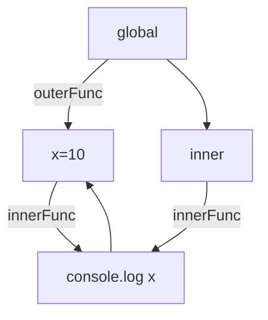
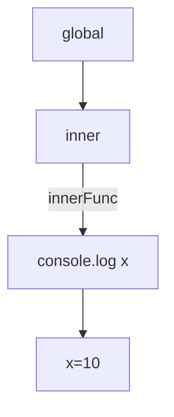

# 선행


---

- [가비지 컬렉터 (Garbage Collector)](https://devshjeon.github.io/docs/%ED%94%84%EB%A1%9C%EA%B7%B8%EB%9E%98%EB%B0%8D/JavaScript/%EA%B0%80%EB%B9%84%EC%A7%80%20%EC%BB%AC%EB%A0%89%ED%84%B0%20(Garbage%20Collector))
- [실행 컨텍스트 (Execute Context)](https://devshjeon.github.io/docs/%ED%94%84%EB%A1%9C%EA%B7%B8%EB%9E%98%EB%B0%8D/JavaScript/%EC%8B%A4%ED%96%89%20%EC%BB%A8%ED%85%8D%EC%8A%A4%ED%8A%B8%20(Execution%20Context))

# 요약


---

- 컨택스트 A에서 선언한 변수 a를 참조하는 내부함수 B를 A의 외부로 전달할 경우, A가 종료된 이후에도 a가 사라지지 않는 현상
- 함수 종료 후에도 사라지지 않는 지역변수를 만들 수 있다.
- 사라지지 않는 변수를 생성하기 때문에 메모리 누수가 발생할 수 있다.

# 클로저 (Closure)란?


---


클로저는 함수와 그 함수가 선언됐을 때의 lexical environment의 조합이다.


위의 내용을 풀어 설명하면 함수는 선언된 환경을 기억하고 호출 시 스코프 체인을 이용해 상위 실행 컨텍스트의 식별자에 접근할 수 있다.


```javascript
function outerFunc() {
  let x = 10;
	let y = 1;
  const innerFunc = function () { console.log(x); };
  return innerFunc;
}

const inner = outerFunc();
inner(); // 10
```


위의 예제에서 `outer` 함수는 내부 함수 `inner`를 반환하고 호출 스택에서 제거되었다. 따라서, `outer` 함수의 변수 `x`는 더 이상 유효하지 않게 되어 접근할 수 없을 것 같지만 실행 결과는 10을 나타내면서 변수 `x`에 접근할 수 있는 것을 확인할 수 있다.


# 도달 가능성 관점에서 본 클로저


이미 종료된 함수의 변수에 접근할 수 있다는 의미는 GC가 해당 변수를 메모리에 반환하지 않았다는 의미이고, 이는 곧 루트 기준으로 해당 변수가 참조된다는 의미이다.


`outerFunc` 함수가 호출되면 도달할 수 있는 참조는 다음과 같다.





`outerFunc` 함수 호출이 종료되면 해당 함수는 더 이상 참조할 수 없다. 하지만, `innerFunc` 함수가 참조하는 `outerFunc` 함수의 변수 `x`는 참조가 가능하기 때문에 GC 수행 후에도 메모리에서 삭제되지 않는다.





따라서 외부에서 변수 `x`를 참조할 수 있다.


클로저를 사용하면 다음과 같은 이점을 얻을 수 있다.

- 전역 변수 사용 방지
- 외부에서 접근할 수 없는 변수 사용 (캡슐화)

위 특징 모두 누군가에 의해 변경될 수 있는 오류를 근본적으로 차단할 수 있기 때문에 프로그램의 안정성을 높이기 위해 클로저는 적극적으로 사용된다.


아래는 `_name`, `_logged` 변수를 외부에서 호출할 수 없도록 캡슐화한 예제이다.


```javascript
function user(_name) {
  let _logged = true;
  return {
    get name() { return _name },
    set name(v) { _name = v },
    login() { _logged = true },
    logout() { _logged = false },
    get status() {
      return _logged ? 'login' : 'logout';
    },
  }
}

const kane = user('kane');

console.log(kane.name) // kane

kane.name = 'jack'
console.log(kane.name) // jack

kane._name = 'kane'
console.log(kane.name) // jack

console.log(kane.status) // login

kane.logout();
console.log(kane.status) // logout

kane.status = true; // status 속성이 없으므로 무시됨
console.log(kane.status) // logout
```


# 메모리 누수


---


위의 예제에서 보았듯이 클로저를 사용하면 내부 변수를 참조하므로 메모리에서 삭제되지 않는다. 따라서, 사용이 끝났으면 명시적으로 `null` 값을 덮어써서 GC 수행 과정에서 메모리 해제를 해주어야 메모리 누수를 막을 수 있다.


이벤트 핸들러의 경우 이벤트가 더 이상 필요하지 않을 때 핸들러를 제거해 주어야 한다.


```javascript
function setupClickHandler() {
  const button = document.getElementById('myButton');

  function handleClick() {
    console.log('Button clicked');
    button.removeEventListener('click', handleClick);
  }

  button.addEventListener('click', handleClick);
}

setupClickHandler();
```


# 참조


---


[http://dmitrysoshnikov.com/ecmascript/chapter-6-closures/](http://dmitrysoshnikov.com/ecmascript/chapter-6-closures/)


[https://poiemaweb.com/js-closure](https://poiemaweb.com/js-closure)

