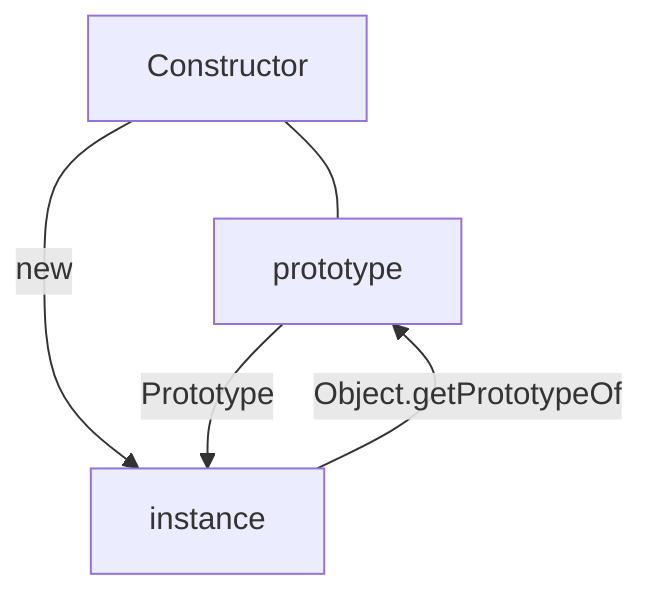
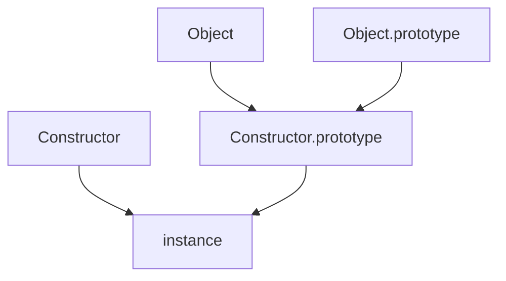

# 키워드


---

- 객체의 공통된 속성을 정의
- 메모리 사용 효율
- 프로토타입 체이닝

# 요약


---

- 프로토타입이란 어떤 객체의 공통된 속성을 정의한 객체로 인스턴스 생성 시 참조변수를 통해 프로터타입 객체에 접근하여 메모리 사용 효율을 높일 수 있다.
- 객체 인스턴스 생성 시, 프로토타입이라는 생성자 함수에서 공통으로 사용하는 변수 및 메서드를 갖고있는 객체를 참조하는 변수 `__proto__` 를 추가해서 인스턴스를 생성한다.

# 프로토타입 (Prototype)이란?


---


프로토타입은 객체를 만드는 과정에서 부모가 되는 객체를 의미하고 자바스크립트의 모든 객체는 자신의 부모 역할을 하는 객체와 연결되어 있다. 


객체 지향의 상속 개념과 같이 부모 객체의 속성 및 메소드를 사용할 수 있는 부모 객체를 **프로토타입** 객체라고 한다.


# 프로토타입 구조


---


프로토타입 생성자의 prototype과 프로토타입 생성자를 `new` 연산자를 통해 생성한 인스턴스의 [[Prototype]] 속성은 같은 객체를 참조한다.


[[Prototype]]은 콘솔에만  표시되는 내용으로 인스턴스에서 직접적으로 참조가 불가능하다.


인스턴스에서 프로토타입 객체에 접근하기 위해서는 2가지 방법이 존재한다.


`instance.__proto__`

- 브라우저에서 제공하는 기능을 호환성 차원에서 제공하는 것이기 때문에 공식적인 방법이 아니다.

`Object.getPrototypeOf(instance)`





객체 생성방법에는 아래와 같은 다양한 방법이 있다.


```javascript
function Person(name) {
  this.name = name;
}

const kane = new Person('kane');
const kaneClone1 = new kane.__proto__.constructor('kane'); // 프로토타입의 생성자 함수인 Person
const kaneClone2 = new kane.constructor('kane'); // 인스턴스의 생성자 함수인 Person
const kaneClone3 = new Object.getPrototypeOf(kane).constructor('kane'); // 프로토타입의 생성자 함수인 Person
const kaneClone4 = new Person.prototype.constructor('kane'); // 생성자함수의 프로토타입의 생성자 함수인 Person
```


# 원시 타입의 확장


---


### 숫자 리터럴


리터럴을 인스턴스인 것 처럼 사용하려고 하면(메소드를 사용하려고 하면), 자바스크립트가 임시로 Number 생성자 함수의 인스턴스를 생성한 후 그 프로토타입에 있는 메소드를 적용해서 원하는 결과를 얻은 다음 인스턴스를 제거한다.


`null`, `undefined` 타입을 제외한 나머지 모든 객체는 생성자 함수가 존재한다.


생성자 함수에는 각 데이터 타입에 해당하는 전용 메서드가 정의되어 있다.


# 메서드 상속


---


프로토타입을 사용하면 공통된 속성 및 메서드를 인스턴스를 생성할 때마다 메모리에 할당할 필요 없이 프로토타입 객체를 참조하는 변수를 통해 프로토타입 객체에 접근할 수 있으므로 메모리 사용 효율을 높일 수 있다.


그렇기 때문에 프로토타입은 어떤 객체가 속한 집단의 공통된 특징을 알 수 있는 좋은 수단이 된다. 


# 프로토타입 체이닝


---


프로토타입도 생성자 함수를 통해 생성된 객체이다. 그렇다면 어떤 생성자 함수를 사용한 것일까? 


그것은 바로 `Object`이다. `null`, `undefined`를 제외한 모든 데이터 타입은 프로토타입을 갖고 있고 이는 `Object` 생성자 함수의 프로토타입에 접근할 수 있다는 것을 의미한다.


`Object`의 프로토타입 객체는 모든 객체에 공통으로 적용되기 때문에 특정한 메서드를 사용할 수 없으며, 이를 구분하기 위해 `Object` 생성자 함수를 사용할 때는 인스턴스를 파라미터로 받아 사용할 수 있도록 `Object.method(instance)`와 같은 형태로 호출할 수 있도록 구현했다.


```javascript
~~obj.freeze();~~  Object.freeze(obj);
~~obj.keys();~~  Object.keys(obj);
```


어떤 인스턴스의 메서드를 호출하면 해당 인스턴스의 함수 및 생성자 함수의 프로토타입 객체에서 메서드를 찾고, 없을 경우에는 상위 객체인 `Object`의 프로토타입 객체에서 메서드를 찾는다.


Array 프로토타입 객체에 정의된 toString 메서드 경우를 보면, 배열 객체에만 공통으로 작동하는 기능이 정의되어 있다. 반면, Object 프로토타입 객체에도 toString 메서드가 정의되어 있다. 


배열 객체에서 toString 메서드를 호출하면 배열 프로토타입 객체에서 toString을 찾고, 해당 메서드가 없을 경우 Object 프로토타입 객체에서 toString 메서드를 찾아 호출한다.


```javascript
[1, 2, 3].toString() // "1, 2, 3"; Array.prototype 객체에 정의된 toString()

delete Array.prototype.toString;

[1, 2, 3].toString(); // "[Object Array]"; Object.prototype 객체에 정의된 toString()

delete Object.prototype.toString;

[1, 2, 3].toString(); // TypeError
```





# 참조


---


[https://www.inflearn.com/course/lecture?courseSlug=핵심개념-javascript-flow&unitId=89259&tab=curriculum](https://www.inflearn.com/course/lecture?courseSlug=%ED%95%B5%EC%8B%AC%EA%B0%9C%EB%85%90-javascript-flow&unitId=89259&tab=curriculum)


[https://poiemaweb.com/js-prototype](https://poiemaweb.com/js-prototype)

